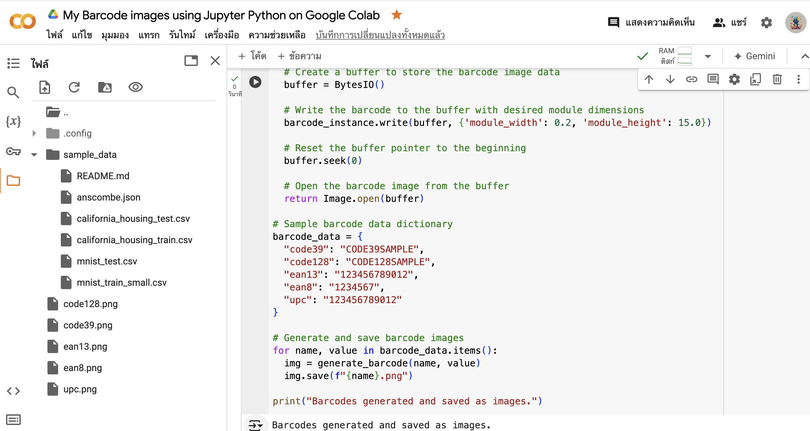

## Barcode Generation with Python in Google Colab

This README outlines how to generate barcode images using Python libraries in a Jupyter Notebook on Google Colab.

### Prerequisites

* A Google Colab account

### Setting Up the Environment

1. Open a new Jupyter Notebook in Google Colab.
2. Install the required libraries within the first code cell:

```python
!pip install python-barcode pillow
```

This command installs the `python-barcode` and `Pillow` libraries needed for barcode generation and image manipulation.

### Script for Generating Barcodes

The provided Python script facilitates creating barcode images of different types:

```python
import barcode
from barcode.writer import ImageWriter
from PIL import Image
from io import BytesIO

def generate_barcode(code_type, code_value):
  """
  Generates a barcode image of the specified type and value.

  Args:
      code_type: String representing the barcode type (e.g., "code39", "ean13").
      code_value: String containing the data to be encoded in the barcode.

  Returns:
      PIL Image object of the generated barcode.
  """
  # Get the barcode class based on the code type
  BARCODE = barcode.get_barcode_class(code_type)
  barcode_instance = BARCODE(code_value, writer=ImageWriter())
  
  # Create a buffer to store the barcode image data
  buffer = BytesIO()
  
  # Write the barcode to the buffer with desired module dimensions
  barcode_instance.write(buffer, {'module_width': 0.2, 'module_height': 15.0})
  
  # Reset the buffer pointer to the beginning
  buffer.seek(0)
  
  # Open the barcode image from the buffer
  return Image.open(buffer)

# Sample barcode data dictionary
barcode_data = {
  "code39": "CODE39SAMPLE",
  "code128": "CODE128SAMPLE",
  "ean13": "123456789012",
  "ean8": "1234567",
  "upc": "123456789012"
}

# Generate and save barcode images
for name, value in barcode_data.items():
  img = generate_barcode(name, value)
  img.save(f"{name}.png")

print("Barcodes generated and saved as images.")
```

**Explanation:**

- The script defines a function `generate_barcode` that takes the barcode type and value as input.
- It retrieves the appropriate barcode class and creates an instance with the provided data.
- A buffer is used to hold the image data temporarily.
- The barcode is written to the buffer with specific settings for module width and height.
- Finally, the image is opened from the buffer and saved as a PNG file.

### Running the Script

1. Copy and paste the entire Python code into a code cell in your Jupyter Notebook.
2. Run the code cell by pressing `Shift + Enter`.
3. The script will generate and save barcode images based on the specified types in the `barcode_data` dictionary.

### Output and Usage

* After running the script, you will find image files named `code39.png`, `code128.png`, and so on in your Colab notebook directory.
* These image files represent the generated barcodes. You can use them for inventory management or any other application requiring barcodes.

## License

This project is licensed under the MIT License. See the [LICENSE](LICENSE) file for details.


## Screenshots



## Contact

For any inquiries or issues, please contact me!

## Author

- **Worachat W, Dev.** - *Data Science, Engineering & Full Stack Dev. 2024*  
  [LinkedIn](https://www.linkedin.com/in/brainwaves-your-ai-playground-82155961/) | [GitHub](https://github.com/worachat-dev) | [Facebook](https://web.facebook.com/NutriCious.Thailand)

**Note:**

* This script provides a sample set of barcode types. You can modify the `barcode_data` dictionary to include different barcode types.
* Remember to adjust the module width and height settings as needed depending on your desired barcode size.

